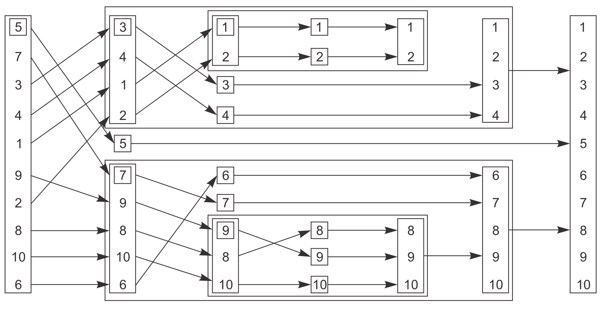
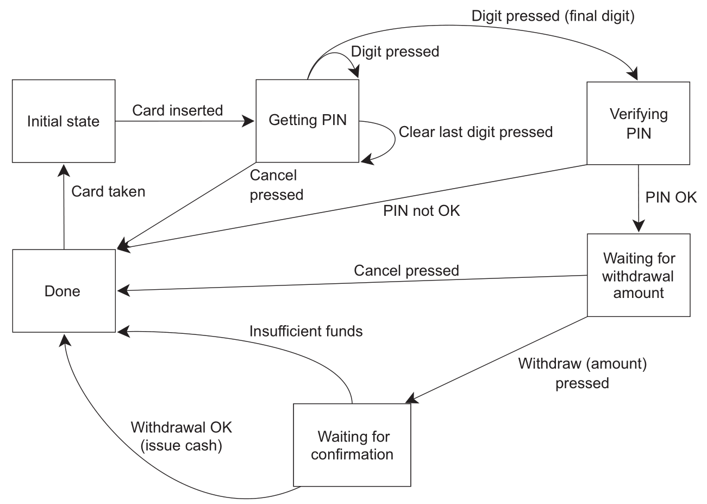

## 等待一个事件或其他条件

* 一个线程要等待另一个线程完成任务，确定完成任务的方法有几种。第一种是持续检查mutex，这种方法显然很浪费资源。第二种是每隔一段时间进行一次检查

```cpp
bool flag;
std::mutex m;

void f()
{
  std::unique_lock<std::mutex> l(m);
  while (!flag)
  {
    l.unlock();
    std::this_thread::sleep_for(std::chrono::milliseconds(100)); // 休眠100ms
    // 休眠期间其他线程就有机会获取mutex并设置flag
    l.lock();
  }
}
```

* 但很难确定适当的休眠时间，过长（会直接影响程序行为，很少见）过短（相当于没有，一样浪费资源）都不好
* 第三种方案是使用条件变量（condition variable），标准库对条件变量提供了两种实现：[std::condition_variable](https://en.cppreference.com/w/cpp/thread/condition_variable)和[std::condition_variable_any](https://en.cppreference.com/w/cpp/thread/condition_variable_any)，前者仅限和[std::mutex](https://en.cppreference.com/w/cpp/thread/mutex)工作，而后者可以与任何满足最低标准的mutex工作（因此加上_any的后缀），更通用也意味着更大的开销，因此一般首选使用前者

```cpp
#include <iostream>
#include <string>
#include <thread>
#include <mutex>
#include <condition_variable>

std::mutex m;
std::condition_variable cv;
std::string data;
bool ready = false;
bool processed = false;

void f()
{
  std::unique_lock<std::mutex> l(m); // 传给wait的只能是std::unique_lock
  cv.wait(l, [] { return ready; }); // 第二个参数为false时解锁mutex阻塞线程
  // 当收到其他线程notify_one时wait会被唤醒，重新检查条件
  data += " after processing";
  processed = true;
  l.unlock();
  cv.notify_one();
}

int main()
{
  std::thread t(f);
  data = "data";
  {
    std::lock_guard<std::mutex> l(m);
    data += " ready";
    ready = true;
    cv.notify_one(); // 唤醒cv.wait，重新检查ready == true
  }
  {
    std::unique_lock<std::mutex> l(m);
    cv.wait(l, [] { return processed; });
  }
  std::cout << data; // data ready after processing
  t.join();
}
```

## 用条件变量实现线程安全的queue

* [std::queue](https://en.cppreference.com/w/cpp/container/queue)的接口如下

```cpp
template<class T, class Container = std::deque<T>>
class queue {
 public:
  explicit queue(const Container&);
  explicit queue(Container&&);
  template<class Alloc> explicit queue(const Alloc&);
  template<class Alloc> explicit queue(const  Container&, const Alloc&);
  template<class Alloc> explicit queue(Container&&, const Alloc&);
  template<class Alloc> explicit queue(const queue&, const Alloc&);
  template<class Alloc> explicit queue(queue&&, const Alloc&);
  
  T& front();
  const T& front() const;
  T& back();
  const T& back() const;
  
  bool empty() const;
  size_type size() const;
  
  void swap(queue&);
  void push(const T&);
  void push(T&&);
  void pop();
  template <class... Args> void emplace(Args&&... args);
};
```

* 和[std::stack](https://en.cppreference.com/w/cpp/container/stack)一样，[std::queue](https://en.cppreference.com/w/cpp/container/queue)的接口设计存在固有竞争，因此需要将front和pop合并成一个函数（就像合并[std::stack](https://en.cppreference.com/w/cpp/container/stack)的top和pop）。这里提供了pop的两个变种，try_pop总会直接返回（即使没有可弹出的值），wait_and_pop等待有值可检索才返回。用之前实现stack的方式实现queue，接口就会像下面这样

```cpp
template<typename T>
class A {
 public:
  A();
  A(const A&);
  A& operator=(const A&) = delete;
  
  void push(T);
  bool try_pop(T&); // 没有可检索的值则返回false
  std::shared_ptr<T> try_pop(); // 直接返回检索值，没有则返回空指针
  
  void wait_and_pop(T&);
  std::shared_ptr<T> wait_and_pop();
  bool empty() const;
};
```

* 使用条件变量完整实现线程安全的queue

```cpp
#include <memory>
#include <mutex>
#include <condition_variable>
#include <queue>

template<typename T>
class A {
  mutable std::mutex m; // 必须可变
  std::queue<T> q;
  std::condition_variable cv;
 public:
  A() {}
  A(const A& rhs)
  {
    std::lock_guard<std::mutex> l(rhs.m);
    q = rhs.q;
  }
  
  void push(T x)
  {
    std::lock_guard<std::mutex> l(m);
    q.push(std::move(x));
    cv.notify_one();
  }
  
  void wait_and_pop(T& x)
  {
    std::unique_lock<std::mutex> l(m);
    cv.wait(l, [this] { return !q.empty(); });
    x = std::move(q.front());
    q.pop();
  }
  
  std::shared_ptr<T> wait_and_pop()
  {
    std::unique_lock<std::mutex> l(m);
    cv.wait(l, [this] { return !q.empty(); });
    std::shared_ptr<T> res(std::make_shared<T>(std::move(q.front())));
    q.pop();
    return res;
  }
  
  bool try_pop(T& x)
  {
    std::lock_guard<std::mutex> l(m);
    if (q.empty()) return false;
    x = std::move(q.front());
    q.pop();
    return true;
  }
  
  std::shared_ptr<T> try_pop()
  {
    std::lock_guard<std::mutex> l(m);
    if (q.empty()) return std::shared_ptr<T>();
    std::shared_ptr<T> res(std::make_shared<T>(std::move(q.front())));
    q.pop();
    return res;
  }
  
  bool empty() const
  {
    std::lock_guard<std::mutex> l(m);
    // 其他线程可能有此对象（拷贝构造）所以要上锁
    return q.empty();
  }
};
```

## 使用期值等待一次性事件

* 标准库提供了只能关联一个事件的唯一期值[std::future](https://en.cppreference.com/w/cpp/thread/future)和能关联多个事件的共享期值[std::shared_future](https://en.cppreference.com/w/cpp/thread/shared_future)，[并发TS](https://en.cppreference.com/w/cpp/experimental/concurrency)中扩展了这两个类，分别为[std::experimental::future](https://en.cppreference.com/w/cpp/experimental/future)和[std::experimental::shared_future](https://en.cppreference.com/w/cpp/experimental/shared_future)
* 最简单的一次性事件就是运行在后台的计算结果，而[std::thread](https://en.cppreference.com/w/cpp/thread/thread)不能获取返回值

```cpp
int f()
{
  return 1;
}

int main()
{
  std::thread t(f); // 如何读取f的返回值？
  t.join();
}
```

### [std::async](https://en.cppreference.com/w/cpp/thread/async)

* 先用[std::async](https://en.cppreference.com/w/cpp/thread/async)启动一个异步任务，它返回一个持有计算结果的[std::future](https://en.cppreference.com/w/cpp/thread/future)，通过[std::future::get](https://en.cppreference.com/w/cpp/thread/future/get)即可阻塞线程，直到期值的状态为ready并返回该结果

```cpp
int f()
{
  return 1;
}

int main()
{
  std::future<int> ft = std::async(f);
  std::cout << ft.get(); // 1
}
```

* [std::async](https://en.cppreference.com/w/cpp/thread/async)和[std::thread](https://en.cppreference.com/w/cpp/thread/thread)一样支持额外的函数参数

```cpp
// 函数
int f(int);
auto ft = std::async(f, 42);

// 成员函数
struct A {
  int f(int);
};

A a;
auto ft1 = std::async(&A::f, &a, 42); // 调用p->f(42)，p是指向x的指针
auto ft2 = std::async(&A::f, a, 42); // 调用tmpa.f(42)，tmpa是a的副本

// 函数对象
struct A {
  int operator()(int);
};
A a;
auto ft1 = std::async(A(), 42); // 调用tmpa(42)，tmpa由A的移动构造函数获得
auto ft2 = std::async(std::ref(a), 42); // 调用a(42)
```

* [std::async](https://en.cppreference.com/w/cpp/thread/async)还可以设置第一个参数为线程的创建策略

```cpp
int f();
// 函数必须异步执行，即运行在不同的线程上
auto ft1 = std::async(std::launch::async, f);
// 函数只在返回的期值调用get或wait时运行
auto ft2 = std::async(std::launch::deferred, f);
// 不指定时的默认启动策略是对两者进行或运算的结果
// auto ft3 = std::async(f)等价于
auto ft3 = std::async(std::launch::async | std::launch::deferred, f);
```

### [std::packaged_task](https://en.cppreference.com/w/cpp/thread/packaged_task)

* 除了[std::async](https://en.cppreference.com/w/cpp/thread/async)，还可以用[std::packaged_task](https://en.cppreference.com/w/cpp/thread/packaged_task)让[std::future](https://en.cppreference.com/w/cpp/thread/future)与任务关联

```cpp
int f();

std::packaged_task<int()> pt(f);
auto ft = pt.get_future();
pt(); // 调用std::packaged_task对象，将std::future设为就绪
std::cout << ft.get();
```

* 很多GUI架构要求用指定线程更新GUI，如果另一个线程要更新GUI，就需要发送信消息给指定线程。使用[std::packaged_task](https://en.cppreference.com/w/cpp/thread/packaged_task)即可实现此功能

```cpp
std::mutex m;
std::deque<std::packaged_task<void()>> d;

void gui_thread() // 更新GUI的指定线程
{
  while (!gui_shutdown_message_received()) // 未收到终止消息则一直轮询
  {
    process_gui_message(); // 处理收到的消息
    std::packaged_task<void()> pt;
    {
      std::lock_guard<std::mutex> l(m);
      if (d.empty()) continue; // 进入下一次循环
      pt = std::move(d.front());
      d.pop_front();
    }
    pt();
  }
}

std::thread t(gui_thread);

template<typename F>
std::future<void> postTask(F f)
{
  std::packaged_task<void()> pt(f);
  std::future<void> res = pt.get_future();
  std::lock_guard<std::mutex> l(m);
  d.push_back(std::move(pt));
  return res;
}
```

### [std::promise](https://en.cppreference.com/w/cpp/thread/promise)

* [std::promise](https://en.cppreference.com/w/cpp/thread/promise)可以显式设置值

```cpp
std::promise<int> ps;
std::future<int> ft = ps.get_future();
ps.set_value(42); // set_value还会将状态设置为就绪
std::cout << ft.get(); // 42
```

* 在线程间对状态发送信号

```cpp
void f(std::promise<void> ps)
{
  std::this_thread::sleep_for(std::chrono::seconds(1));
  ps.set_value();
}

int main()
{
  std::promise<void> ps;
  std::future<void> ft = ps.get_future();
  std::thread t(f, std::move(ps));
  ft.wait(); // 阻塞直到set_value，相当于没有返回值的get
  t.join();
}
```

* 一个[std::promise](https://en.cppreference.com/w/cpp/thread/promise)只能关联一个[std::future](https://en.cppreference.com/w/cpp/thread/future)，关联多次时将抛出[std::future_error](https://en.cppreference.com/w/cpp/thread/future_error)异常

```cpp
std::promise<int> ps;
auto ft1 = ps.get_future();
auto ft2 = ps.get_future(); // 抛出std::future_error异常
```

### 将异常存储于期值中

```cpp
int f(int x)
{
  if (x < 0)
  {
    throw std::out_of_range("x < 0");
  }
  return 1;
}

int main()
{
  auto ft = std::async(f, -1); // ft将存储异常
  int x = ft.get(); // 抛出已存储的异常
}
```

* [std::promise](https://en.cppreference.com/w/cpp/thread/promise)也支持此功能

```cpp
int main()
{
  std::promise<int> ps;
  auto ft = ps.get_future();
  std::thread t([&ps]
  {
    try
    {
      ps.set_value(f(-1)); // 此时还没有存储异常
    }
    catch(...)
    {
      ps.set_exception(std::current_exception()); // 存储异常
    }
  });
  t.join();
  ft.get(); // 抛出异常
}
```

* 如果[std::packaged_task](https://en.cppreference.com/w/cpp/thread/packaged_task)和[std::promise](https://en.cppreference.com/w/cpp/thread/promise)直到析构都未设置值，[std::future::get](https://en.cppreference.com/w/cpp/thread/future/get)也会抛出[std::future_error](https://en.cppreference.com/w/cpp/thread/future_error)异常

```cpp
int f();

int main()
{
  std::future<int> ft;
  {
    std::packaged_task<int()> pt(f);
    ft = pt.get_future();
    // std::promise<int> ps;
    // ft = ps.get_future();
  }
  ft.get(); // 抛出异常
}
```

### [std::shared_future](https://en.cppreference.com/w/cpp/thread/shared_future)

* [std::future](https://en.cppreference.com/w/cpp/thread/future)调用[get](https://en.cppreference.com/w/cpp/thread/future/get)后就无法再次[get](https://en.cppreference.com/w/cpp/thread/future/get)，也就是说只能获取一次数据，此外还会导致所在线程与其他线程数据不同步。[std::shared_future](https://en.cppreference.com/w/cpp/thread/shared_future)就可以解决此问题

```cpp
std::promise<int> ps;
std::future<int> ft(ps.get_future());
assert(ft.valid());
std::shared_future<int> sf(std::move(ft));
assert(!ft.valid());
assert(sf.valid());
```

* 也可以直接构造

```cpp
std::promise<int> ps;
// std::future隐式转换为std::shared_future
std::shared_future<int> sf(ps.get_future());
```

* 用[std::future::share](https://en.cppreference.com/w/cpp/thread/future/share)可以直接生成[std::shared_future](https://en.cppreference.com/w/cpp/thread/shared_future)，这样就可以直接用auto简化声明[std::shared_future](https://en.cppreference.com/w/cpp/thread/shared_future)

```cpp
std::promise<int> ps;
auto sf = ps.get_future().share();
```

* 每一个[std::shared_future](https://en.cppreference.com/w/cpp/thread/shared_future)对象上返回的结果不同步，为了避免多线程访问同一[std::shared_future](https://en.cppreference.com/w/cpp/thread/shared_future)对象时的数据竞争就必须加锁保护。更好的方法是给每个线程拷贝一个[std::shared_future](https://en.cppreference.com/w/cpp/thread/shared_future)对象，这样就可以安全访问而无需加锁

## 限定等待时间

* 阻塞调用的时间不确定，在一些情况下需要限制等待时间。指定超时的方式有两种，一是指定一段延迟的时间（duration），另一种是指定一个时间点

### 时钟（clock）

* 对于标准库来说，时钟就是时间信息源。具体来说，时钟是提供了四种信息的类
  * 当前时间：如[std::chrono::system_clock::now()](https://en.cppreference.com/w/cpp/chrono/system_clock/now)
  * 表示时间值的类型：[std::chrono::time_point](https://en.cppreference.com/w/cpp/chrono/time_point)
  * 时钟节拍（一个嘀嗒的周期）：一般一秒有25个节拍，一个周期则为[std::ratio\<1, 25\>](https://en.cppreference.com/w/cpp/numeric/ratio/ratio)
  * 通过时钟节拍确定时钟是否稳定（steady，匀速）：[std::chrono::steady_clock::is_steady](https://en.cppreference.com/w/cpp/chrono/steady_clock)（稳定时钟，代表系统时钟的真实时间）、[std::chrono::system_clock::is_steady](https://en.cppreference.com/w/cpp/chrono/system_clock)（一般因为时钟可调节而不稳定，即使这是为了考虑本地时钟偏差的自动调节）、[high_resolution_clock::is_steady](https://en.cppreference.com/w/cpp/chrono/high_resolution_clock)（最小节拍最高精度的时钟）
* 打印当前系统时间（如果出现localtime不安全的警告，则在`配置属性 - C/C++ - 预处理器 - 预处理器定义`添加`_CRT_SECURE_NO_WARNINGS`）

```cpp
std::chrono::system_clock::time_point now = std::chrono::system_clock::now();
std::time_t now_c = std::chrono::system_clock::to_time_t(now); // 转为整数
std::cout << std::put_time(std::localtime(&now_c), "%F %T"); // %F即%Y-%m-%d，%T即%H:%M:%S
```

### [std::chrono::duration](https://en.cppreference.com/w/cpp/chrono/duration)

* 标准库提供了表示时间间隔类型的[std::chrono::duration](https://en.cppreference.com/w/cpp/chrono/duration)

```cpp
// 比如将表示秒的类型定义为
std::duration<int> // 即std::chrono::seconds
// 则表示分的类型可定义为
std::duration<int, std::ratio<60>> // 即std::chrono::minutes
// 表示毫秒的类型可定义为
std::duration<int, std::ratio<1, 1000>> // 即std::chrono::milliseconds
```

* C++14的[std::chrono_literals](https://en.cppreference.com/w/cpp/language/user_literal%23Standard_library)提供了表示时间的后缀

```cpp
using namespace std::chrono_literals;
auto x = 45min; // 等价于std::chrono::minutes(45)
std::cout << x.count(); // 45
auto y = std::chrono::duration_cast<std::chrono::seconds>(x);
std::cout << y.count(); // 2700
auto z = std::chrono::duration_cast<std::chrono::hours>(x);
std::cout << z.count(); // 0（转换会截断）
```

* 标准库通过字面值运算符模板实现此后缀功能

```cpp
constexpr std::chrono::minutes operator ""min(unsigned long long m)
{
  return std::chrono::minutes(m);
}
```

* duration支持四则运算

```cpp
using namespace std::chrono_literals;
auto x = 1h;
auto y = 15min;
auto z = x - 2 * y;
std::cout << z.count(); // 30
```

* 使用duration即可设置等待时间

```cpp
int f();
auto ft = std::async(f);

using namespace std::chrono_literals;
if (ft.wait_for(1s) == std::future_status::ready)
{
  std::cout << ft.get();
}
```

### [std::chrono::time_point](https://en.cppreference.com/w/cpp/chrono/time_point)

* time_point是表示时间的类型，值为从某个时间点（比如unix时间戳：1970年1月1日0时0分）开始计时的时间长度

```cpp
// 第一个模板参数为开始时间点的时钟类型，第二个为时间单位
std::chrono::time_point<std::chrono::system_clock, std::chrono::seconds>
```

* time_point可以加减dutation

```cpp
using namespace std::chrono_literals;
auto x = std::chrono::high_resolution_clock::now();
auto y = x + 1s;
std::cout << std::chrono::duration_cast<std::chrono::milliseconds>(y - x).count();
```

* 两个time_point也能相减

```cpp
auto start = std::chrono::high_resolution_clock::now();
doSomething();
auto stop = std::chrono::high_resolution_clock::now();
std::cout << std::chrono::duration_cast<std::chrono::milliseconds>(stop - start).count();
```

* 使用绝对的时间点来设置等待时间

```cpp
std::condition_variable cv;
bool done;
std::mutex m;

bool wait_loop()
{
  const auto timeout = std::chrono::steady_clock::now() + std::chrono::milliseconds(500);
  std::unique_lock<std::mutex> l(m);
  while (!done)
  {
    if (cv.wait_until(l, timeout) == std::cv_status::timeout) break;
  }
  return done;
}
```

### 接受timeout的函数

* timeout可以用于休眠，比如[std::this_thread::sleep_for](https://en.cppreference.com/w/cpp/thread/sleep_for)和[std::this_thread::sleep_until](https://en.cppreference.com/w/cpp/thread/sleep_until)，此外timeout还能配合条件变量、期值甚至mutex使用。[std::mutex](https://en.cppreference.com/w/cpp/thread/mutex)和[std::recursive_mutex](https://en.cppreference.com/w/cpp/thread/recursive_mutex)不支持timeout，而[std::timed_mutex](https://en.cppreference.com/w/cpp/thread/timed_mutex)和[std::recursive_timed_mutex](https://en.cppreference.com/w/cpp/thread/recursive_timed_mutex)支持，它们提供了[try_lock_for](https://en.cppreference.com/w/cpp/thread/timed_mutex/try_lock_for)和[try_lock_until](https://en.cppreference.com/w/cpp/thread/timed_mutex/try_lock_until)
* 支持timeout的函数有
  * [std::this_thread::sleep_for](https://en.cppreference.com/w/cpp/thread/sleep_for)
  * [std::this_thread::sleep_until](https://en.cppreference.com/w/cpp/thread/sleep_until)
  * [std::condition_variable::wait_for](https://en.cppreference.com/w/cpp/thread/condition_variable/wait_for)
  * [std::condition_variable::wait_until](https://en.cppreference.com/w/cpp/thread/condition_variable/wait_until)
  * [std::condition_variable_any::wait_for](https://en.cppreference.com/w/cpp/thread/condition_variable_any/wait_for)
  * [std::condition_variable_any::wait_until](https://en.cppreference.com/w/cpp/thread/condition_variable_any/wait_until)
  * [std::timed_mutex::try_lock_for](https://en.cppreference.com/w/cpp/thread/timed_mutex/try_lock_for)
  * [std::timed_mutex::try_lock_until](https://en.cppreference.com/w/cpp/thread/timed_mutex/try_lock_until)
  * [std::recursive_timed_mutex::try_lock_for](https://en.cppreference.com/w/cpp/thread/recursive_timed_mutex/try_lock_for)
  * [std::recursive_timed_mutex::try_lock_until](https://en.cppreference.com/w/cpp/thread/recursive_timed_mutex/try_lock_until)
  * [std::unique_lock::try_lock_for](https://en.cppreference.com/w/cpp/thread/unique_lock/try_lock_for)
  * [std::unique_lock::try_lock_until](https://en.cppreference.com/w/cpp/thread/unique_lock/try_lock_until)
  * [std::future::wait_for](https://en.cppreference.com/w/cpp/thread/future/wait_for)
  * [std::future::wait_until](https://en.cppreference.com/w/cpp/thread/future/wait_until)
  * [std::shared_future::wait_for](https://en.cppreference.com/w/cpp/thread/shared_future/wait_for)
  * [std::shared_future::wait_until](https://en.cppreference.com/w/cpp/thread/shared_future/wait_until)

## 使用同步操作简化代码

### 使用期值进行函数式编程（functional programming）

* FP不会改变外部状态，不修改共享数据就不存在race condition，因此也就没有必要使用锁
* 以快速排序为例



* 快速排序的顺序实现（虽然接口是函数式，但考虑到FP实现需要大量拷贝操作，所以内部使用命令式）

```cpp
template<typename T>
std::list<T> f(std::list<T> v)
{
  if (v.empty()) return v;
  std::list<T> res;
  // std::list::splice用于转移另一个list中的元素到目标list
  res.splice(res.begin(), v, v.begin()); // 将v的首元素移到res中
  const T& firstVal = *res.begin();
  // std::partition按条件在原容器上划分为两部分
  // 并返回划分点（第一个不满足条件元素）的迭代器
  auto it = std::partition(v.begin(), v.end(), [&](const T& x) { return x < firstVal; });
  std::list<T> low;
  low.splice(low.end(), v, v.begin(), it); // 转移左半部分到low
  auto l(f(std::move(low))); // 对左半部分递归排序
  auto r(f(std::move(v))); // 对右半部分递归排序
  res.splice(res.end(), r);
  res.splice(res.begin(), l);
  return res;
}
```

* 使用期值实现并行的快速排序

```cpp
template<typename T>
std::list<T> f(std::list<T> v)
{
  if (v.empty()) return v;
  std::list<T> res;
  res.splice(res.begin(), v, v.begin());
  const T& firstVal = *res.begin();
  auto it = std::partition(v.begin(), v.end(), [&](const T& x) { return x < firstVal; });
  std::list<T> low;
  low.splice(low.end(), v, v.begin(), it);
  // 用另一个线程对左半部分排序
  std::future<std::list<T>> l(std::async(&f<T>, std::move(low)));
  // 其他不变
  auto r(f(std::move(v)));
  res.splice(res.end(), r);
  res.splice(res.begin(), l.get()); // 获取future中的值
  return res;
}
```

* FP不仅是并发编程的典范，还是CSP（Communicating Sequential Processer）的典范。CSP中的线程理论上是分开的，没有共享数据，但communication channel允许消息在不同线程间传递，这被Erlang所采用，并在MPI（Message Passing Interface）上常用来做C和C++的高性能计算

### 使用消息传递进行同步操作

* CSP的思路很简单，如果没有共享数据，每个线程可以完全独立地思考，其行为取决于收到的消息。因此每个线程实际上是一个状态机，收到一条消息时就以某种方式更新状态，并且还可能发送消息给其他线程
* 真正的CSP没有共享数据，所有通信通过消息队列传递，但由于C++线程共享地址空间，因此无法强制实现这个要求。所以这就需要引入一些约定，作为应用或者库的作者，必须确保在线程间不会共享数据（当然为了通信，必须共享消息队列）
* 考虑实现一个ATM应用，它需要处理取钱时和银行的交互，并控制物理机器对银行卡的反应。一个处理方法是分三个线程，分别处理物理机器、ATM逻辑、与银行的交互，线程间通过消息通讯而非共享数据，比如插卡时机器线程发送消息给逻辑线程，逻辑线程返回一条消息通知机器线程可以给多少钱
* 一个简单的ATM逻辑的状态机建模如下



* 这个状态机可以用一个类实现，类中有一个表示状态的成员函数

```cpp
struct card_inserted
{
  std::string account;
};

class atm
{
  messaging::receiver incoming;
  messaging::sender bank;
  messaging::sender interface_hardware;
  void (atm::*state)();
  std::string account;
  std::string pin;
  
  void waiting_for_card()
  {
    interface_hardware.send(display_enter_card());
    incoming.wait()
    .handle<card_inserted>([&](const card_inserted& msg)
    {
      account = msg.account;
      pin = "";
      interface_hardware.send(display_enter_pin());
      state = &atm::getting_pin;
    });
  }
  
  void getting_pin();
 public:
  void run()
  {
    state = &atm::waiting_for_card;
    try
    {
      for (;;) (this->*state)();
    }
    catch(const messaging::close_queue&) {}
  }
};
```

* getting_pin的实现比较繁琐，它要处理三种不同的消息

```cpp
void atm::getting_pin()
{
  incoming.wait()
  .handle<digit_pressed>([&](const digit_pressed& msg)
  {
    const unsigned pin_length = 4;
    pin += msg.digit;
    if (pin.length() == pin_length)
    {
      bank.send(verify_pin(account, pin, incoming));
      state = &atm::verifying_pin;
    }
  })
  .handle<clear_last_pressed>([&](const clear_last_pressed& msg)
  {
    if (!pin.empty()) pin.resize(pin.length() - 1);
  })
  .handle<cancel_pressed>([&](const cancel_pressed& msg)
  {
    state = &atm::done_processing;
  });
}
```

* 这里不需要考虑同步和并发的问题，只要考虑在某个点接受和发送的消息。这个ATM逻辑的状态机与系统的其他部分各自运行在独立的线程上，这种设计方式称为actor model，系统中有多个独立的actor，actor之间可以互相发送消息但不会共享状态，这种方式可以极大简化并发系统的设计
* 完整的代码实现[见此](../code/ATM完整示例.cpp)，VS2017编译出错，在[C++ Shell](http://cpp.sh/)上能编译成功

### [std::experimental::future](https://en.cppreference.com/w/cpp/experimental/future)

* [并发TS](https://en.cppreference.com/w/cpp/experimental/concurrency)中提供了[std::experimental::promise](https://en.cppreference.com/w/cpp/experimental/concurrency/promise)和[std::experimental::packaged_task](https://en.cppreference.com/w/cpp/experimental/concurrency/packaged_task)，与标准库唯一不同的是，它们返回[std::experimental::future](https://en.cppreference.com/w/cpp/experimental/future)，这个期值提供了持续性
* 需要处理[std::future](https://en.cppreference.com/w/cpp/thread/future)的结果时，必须等待其调用成员函数，这很不方便。持续性带来的好处是数据就绪就（then）进行处理，调用[std::experimental::future::then](https://en.cppreference.com/w/cpp/experimental/future/then)即可添加持续性

```cpp
int f(std::experimental::future<int>);

std::experimental::future<int> eft;
auto ft1 = eft(); // std::experimental::future由本身的构造函数生成
// 添加持续性并返回新的期值，该期值持有持续性调用的结果
// 与std::async不同，不能传入f的参数
// 因为参数已经在运行库中定义为了一个就绪的期值
// 这里f的返回int，因此参数就是std::experimental::future<int>
auto ft2 = ft1.then(f);
// then后原期值就无效了
assert(!ft1.valid());
assert(ft2.valid());
```

* [std::async](https://en.cppreference.com/w/cpp/thread/async)只能返回[std::future](https://en.cppreference.com/w/cpp/thread/future)，如果想返回[std::experimental::future](https://en.cppreference.com/w/cpp/experimental/future)则需要手动实现一个新的async

```cpp
template<typename F>
std::experimental::future<decltype(std::declval<F>()())>
new_async(F&& func)
{
  std::experimental::promise<decltype(std::declval<F>()())> p;
  auto ft = p.get_future();
  std::thread t(
    [p = std::move(p), f = std::decay_t<F>(func)]() mutable {
      try {
        p.set_value_at_thread_exit(f());
      } catch(...) {
        p.set_exception_at_thread_exit(std::current_exception());
      }
    }
  );
  t.detach();
  return ft;
}
```

* 假如要实现一个登录逻辑，将用户名和密码发送给后台验证，取得用户信息后更新到显示界面，串行实现如下

```cpp
void process_login(const std::string& username, const std::string& password)
{
  try {
    const user_id id = backend.authenticate_user(username, password);
    const user_data info_to_display = backend.request_current_info(id);
    update_display(info_to_display);
  } catch(std::exception& e) {
    display_error(e);
  }
}
```

* 为了不阻塞UI线程，就需要异步实现

```cpp
std::future<void> process_login(const std::string& username, const std::string& password)
{
  return std::async(std::launch::async, [=] () {
    try {
      const user_id id = backend.authenticate_user(username, password);
      const user_data info_to_display = backend.request_current_info(id);
      update_display(info_to_display);
    } catch(std::exception& e) {
      display_error(e);
    }
  });
}
```

* 但这个实现仍然会阻塞UI线程，为此就需要持续性的机制，每个任务完成后连接到前一个任务上

```cpp
std::experimental::future<void> process_login(const std::string& username, const std::string& password)
{
  return new_async([=] () {
    return backend.authenticate_user(username, password);
  })
  .then([] (std::experimental::future<user_id> id) {
    return backend.request_current_info(id.get());
  })
  .then([] (std::experimental::future<user_data> info_to_display) {
    try {
      update_display(info_to_display.get());
    } catch(std::exception& e) {
      display_error(e);
    }
  });
}
```

* 如果调用后台函数内部阻塞，可能是因为需要等待消息通过网络或者完成一个数据库操作，而你还没有完成这些。你可能会把任务划分为多个独立部分，但它们仍会阻塞调用，最终仍会得到阻塞的线程。这时后台调用真正需要的是在数据准备好时返回就绪的期值，而不阻塞任何线程，所以这里用返回`std::experimental::future<user_id>`的`backend.async_authenticate_user`替代返回`user_id`的`backend.authenticate_user`

```cpp
std::experimental::future<void> process_login(const std::string& username, const std::string& password)
{
  return backend.async_authenticate_user(username, password)
  .then([] (std::experimental::future<user_id> id) {
    return backend.async_request_current_info(id.get());
  })
  .then([] (std::experimental::future<user_data> info_to_display) {
    try {
      update_display(info_to_display.get());
    } catch(std::exception& e) {
      display_error(e);
    }
  });
}
```

* 这样就是在异步函数链上就不存在阻塞了。最后这里还可以用泛型lambda来简化代码

```cpp
std::experimental::future<void> process_login(const std::string& username, const std::string& password)
{
  return backend.async_authenticate_user(username, password)
  .then([] (auto id) {
    return backend.async_request_current_info(id.get());
  })
  .then([] (auto info_to_display) {
    try {
      update_display(info_to_display.get());
    } catch(std::exception& e) {
      display_error(e);
    }
  });
}
```

* 除了[std::experimental::future](https://en.cppreference.com/w/cpp/experimental/future)，支持持续性的还有 [std::experimental::shared_future](https://en.cppreference.com/w/cpp/experimental/shared_future)

```cpp
auto ft1 = new_async(some_function).share();
auto ft2 = ft1.then([] (std::experimental::shared_future<some_data> data) {
  do_stuff(data);
});
auto ft3 = ft1.then([] (std::experimental::shared_future<some_data> data) {
  return do_other_stuff(data);
});
```

### [std::experimental::when_all](https://en.cppreference.com/w/cpp/experimental/when_all)

* 使用[std::async](https://en.cppreference.com/w/cpp/thread/async)从多个期值中获取结果

```cpp
std::future<FinalResult> process_data(std::vector<MyData>& vec)
{
  const size_t chunk_size = whatever;
  std::vector<std::future<ChunkResult>> res;
  for (auto begin = vec.begin(), end = vec.end(); beg! = end;)
  {
    const size_t remaining_size = end - begin;
    const size_t this_chunk_size = std::min(remaining_size, chunk_size);
    res.push_back(std::async(process_chunk, begin, begin + this_chunk_size));
    begin += this_chunk_size;
  }
  return std::async([all_results = std::move(res)] () {
    std::vector<ChunkResult> v;
    v.reserve(all_results.size());
    for (auto& f: all_results)
    {
      v.push_back(f.get()); // 这里会导致反复唤醒，增加了很多开销
    }
    return gather_results(v);
  });
}
```

* 使用[std::experimental::when_all](https://en.cppreference.com/w/cpp/experimental/when_all)可以避免反复唤醒导致的开销，为其传入一组需要等待的期值，将返回一个新的期值。当传入的所有期值都就绪时，则返回的期值就绪

```cpp
std::experimental::future<FinalResult> process_data(std::vector<MyData>& vec)
{
  const size_t chunk_size = whatever;
  std::vector<std::experimental::future<ChunkResult>> res;
  for (auto begin = vec.begin(), end = vec.end(); beg! = end;)
  {
    const size_t remaining_size = end - begin;
    const size_t this_chunk_size = std::min(remaining_size, chunk_size);
    res.push_back(new_async(process_chunk, begin, begin + this_chunk_size));
    begin += this_chunk_size;
  }
  return std::experimental::when_all(res.begin(), res.end())
  .then([] (std::future<std::vector<std::experimental::future<ChunkResult>>> ready_results)
  {
    std::vector<std::experimental::future<ChunkResult>>
    all_results = ready_results.get();
    std::vector<ChunkResult> v;
    v.reserve(all_results.size());
    for (auto& f: all_results)
    {
      v.push_back(f.get());
    }
    return gather_results(v);
  });
}
```

### [std::experimental::when_any](https://en.cppreference.com/w/cpp/experimental/when_any)

* 在传入的期值中有一个就绪时，则[std::experimental::when_any](https://en.cppreference.com/w/cpp/experimental/when_any)返回的期值就绪

```cpp
std::experimental::future<FinalResult>
find_and_process_value(std::vector<MyData>& data)
{
  const unsigned concurrency = std::thread::hardware_concurrency();
  const unsigned num_tasks = (concurrency > 0) ? concurrency : 2;
  std::vector<std::experimental::future<MyData*>> res;
  const auto chunk_size = (data.size() + num_tasks - 1) / num_tasks;
  auto chunk_begin = data.begin();
  std::shared_ptr<std::atomic<bool>> done_flag = std::make_shared<std::atomic<bool>>(false);
  for (unsigned i = 0; i < num_tasks; ++i)
  { // 产生num_tasks个异步任务到res中
    auto chunk_end = (i < (num_tasks - 1)) ? chunk_begin + chunk_size : data.end();
    res.push_back(new_async([=] {
      for (auto entry = chunk_begin; !*done_flag && (entry != chunk_end); ++entry)
      {
        if (matches_find_criteria(*entry))
        {
          *done_flag = true;
          return &*entry;
        }
      }
      return (MyData**)nullptr;
    }));
    chunk_begin = chunk_end;
  }
  std::shared_ptr<std::experimental::promise<FinalResult>> final_result =
    std::make_shared<std::experimental::promise<FinalResult>>();

  struct DoneCheck {
    std::shared_ptr<std::experimental::promise<FinalResult>> final_result;
    
    DoneCheck(std::shared_ptr<std::experimental::promise<FinalResult>> final_result_)
    : final_result(std::move(final_result_)) {}
    
    void operator()(
      std::experimental::future<std::experimental::when_any_result<
        std::vector<std::experimental::future<MyData*>>>> res_param)
    {
      auto res = res_param.get();
      MyData* const ready_result = res.futures[res.index].get(); // 从就绪的期值中获取值
      // 找到符合条件的值则处理结果并set_value
      if (ready_result)
      {
        final_result->set_value(process_found_value(*ready_result));
      }
      else
      {
        res.futures.erase(res.futures.begin() + res.index); // 否则丢弃值
        if (!res.futures.empty())
        { // 如果还有需要检查的值则再次调用when_any
          std::experimental::when_any(res.futures.begin(), res.futures.end())
          .then(std::move(*this));
        }
        else
        { // 如果没有其他期值则在promise中设置一个异常
          final_result->set_exception(std::make_exception_ptr(std::runtime_error("Not found")));
        }
      }
    }
  };
  std::experimental::when_any(res.begin(), res.end()).then(DoneCheck(final_result));
  return final_result->get_future();
}
```

* when_all和when_any除了可以接收一对迭代器，也可以直接接受期值

```cpp
std::experimental::future<int> ft1 = new_async(f1);
std::experimental::future<std::string> ft2 = new_async(f2);
std::experimental::future<double> ft3 = new_async(f3);
std::experimental::future<
  std::tuple<
    std::experimental::future<int>,
    std::experimental::future<std::string>,
    std::experimental::future<double>>> res =
  std::experimental::when_all(std::move(ft1), std::move(ft2), std::move(ft3));
```

### [std::experimental::latch](https://en.cppreference.com/w/cpp/experimental/latch)

* [std::experimental::latch](https://en.cppreference.com/w/cpp/experimental/latch)用一个计数器值构造，等待事件发生时就调用[std::experimental::latch::count_down](https://en.cppreference.com/w/cpp/experimental/latch/count_down)将计数器值减一，计数器值为0时则[std::experimental::latch::is_ready](https://en.cppreference.com/w/cpp/experimental/latch/is_ready)返回true，如果想让计数器减一并阻塞至0则可以调用[std::experimental::latch::count_down_and_wait](https://en.cppreference.com/w/cpp/experimental/latch/count_down_and_wait)
* 用[std::experimental::latch](https://en.cppreference.com/w/cpp/experimental/latch)等待事件

```cpp
void f()
{
  const unsigned thread_count = ...;
  std::experimental::latch done(thread_count); // 用计数器值构造latch
  my_data data[thread_count];
  std::vector<std::future<void>> threads;
  for (unsigned i = 0; i < thread_count; ++i)
  {
    threads.push_back(std::async(std::launch::async, [&, i] {
      data[i] = make_data(i);
      done.count_down(); // 在进行下一步之前先递减计数器
      do_more_stuff();
    }));
  }
  done.wait(); // 等待至计数器为0
  process_data(data, thread_count);
}
```

### [std::experimental::barrier](https://en.cppreference.com/w/cpp/experimental/barrier)

* 一组处理数据的线程，处理过程中独立，无需同步，但在处理下一项数据前，必须要求所有线程完成任务。[std::experimental::barrier](https://en.cppreference.com/w/cpp/experimental/barrier)就可以用于处理这种情况，它用线程的数量构造，调用[std::experimental::barrier::arrive_and_wait](https://en.cppreference.com/w/cpp/experimental/barrier/arrive_and_wait)会阻塞至所有线程完成任务，当最后一个线程完成任务时，所有线程被释放，barrier被重置。如果想从线程集中移除线程，可以让该线程在barrier上调用[std::experimental::barrier::arrive_and_drop](https://en.cppreference.com/w/cpp/experimental/barrier/arrive_and_drop)

```cpp
result_chunk process(data_chunk);
std::vector<data_chunk> divide_into_chunks(data_block data, unsigned num_threads);

void process_data(data_source& source, data_sink& sink) // 源数据和输出数据
{
  const unsigned concurrency = std::thread::hardware_concurrency();
  const unsigned num_threads = (concurrency > 0) ? concurrency : 2;
  std::experimental::barrier b(num_threads); // 构造barrier
  std::vector<joining_thread> threads(num_threads);
  std::vector<data_chunk> chunks;
  result_block res;
  for (unsigned i = 0; i < num_threads; ++i)
  {
    threads[i] = joining_thread([&, i] {
      while (!source.done()) // 循环至处理完所有任务
      {
        if (i == 0)
        { // 线程0拆分数据
          data_block current_block = source.get_next_data_block();
          chunks = divide_into_chunks(current_block, num_threads);
        }
        b.arrive_and_wait(); // 这里阻塞是因为其他线程必须等待线程0初始化
        res.set_chunk(i, num_threads, process(chunks[i])); // 更新结果到res
        b.arrive_and_wait(); // 这里阻塞是因为写入前线程0必须等待其他线程完成
        if (i == 0) sink.write_data(std::move(res)); // 只有线程0可以输出结果
      }
    });
  }
}
```

### [std::experimental::flex_barrier](https://en.cppreference.com/w/cpp/experimental/flex_barrier)

* [std::experimental::flex_barrier](https://en.cppreference.com/w/cpp/experimental/flex_barrier)比[std::experimental::barrier](https://en.cppreference.com/w/cpp/experimental/barrier)，但开销更大，此外[std::experimental::flex_barrier](https://en.cppreference.com/w/cpp/experimental/flex_barrier)还要多接受一个函数作为参数，当所有线程到达阻塞点时，由其中一个线程运行该函数
* 下面用[std::experimental::flex_barrier](https://en.cppreference.com/w/cpp/experimental/flex_barrier)简化上面的例子

```cpp
void process_data(data_source& source, data_sink& sink)
{
  const unsigned concurrency = std::thread::hardware_concurrency();
  const unsigned num_threads = (concurrency > 0) ? concurrency : 2;
  std::vector<data_chunk> chunks;
  auto split_source = [&] {
    if (!source.done())
    {
      data_block current_block = source.get_next_data_block();
      chunks = divide_into_chunks(current_block, num_threads);
    }
  };
  split_source(); // 先调用上面的lambda拆分数据
  result_block res;
  std::experimental::flex_barrier sync(num_threads, [&] {
    sink.write_data(std::move(res)); // 每次迭代完成输出一次结果
    split_source(); // 并为下一次迭代拆分数据
    return -1; // 必须返回不小于-1的值且不抛出异常，-1表示线程数不变
    // 返回其他值则表示下一周期的线程数
  });
  std::vector<joining_thread> threads(num_threads);
  for (unsigned i = 0; i < num_threads; ++i)
  {
    threads[i] = joining_thread([&, i] {
      while (!source.done())
      {
        res.set_chunk(i, num_threads, process(chunks[i])); // 更新结果到res
        sync.arrive_and_wait(); // 只需要一个阻塞点
      }
    });
  }
}
```
