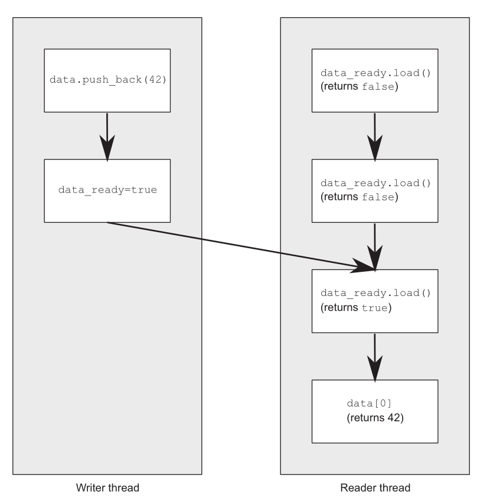
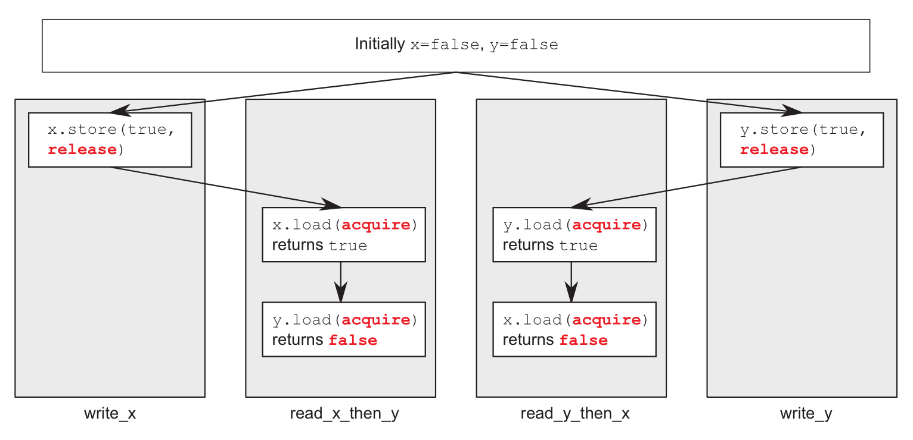
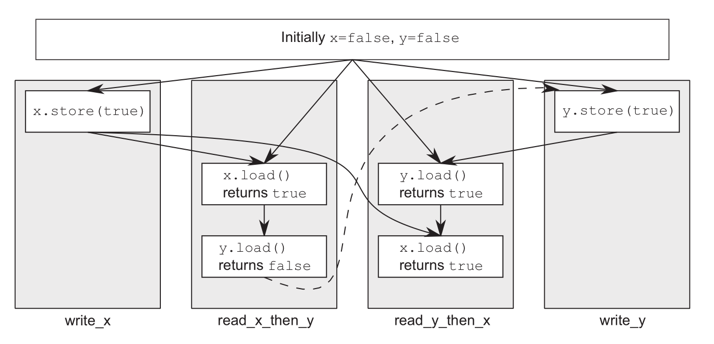

## 内存模型基础

* 为了避免race condition，线程就要规定执行顺序。一种方式是使用mutex，后一线程必须等待前一线程解锁。第二种方式是使用原子操作来避免竞争访问同一内存位置
* 原子操作是不可分割的操作，要么做了要么没做，不存在做一半的状态。如果读取对象值的加载操作是原子的，那么对象上的所有修改操作也是原子的，读取的要么是初始值，要么是某个修改完成后的存储值。因此，原子操作不存在修改过程中值被其他线程看到的情况，也就避免了竞争风险
* 每个对象从初始化开始都有一个修改顺序，这个顺序由来自所有线程对该对象的写操作组成。通常这个顺序在运行时会变动，但在任何给定的程序执行中，系统中所有线程都必须遵循此顺序
* 如果对象不是原子类型，就要通过同步来保证线程遵循每个变量的修改顺序。如果一个变量对于不同线程表现出不同的值序列，就会导致数据竞争和未定义行为。使用原子操作就可以把同步的责任抛给编译器

## 原子操作和原子类型

### 标准原子类型

* 标准原子类型定义在[\<atomic\>](https://en.cppreference.com/w/cpp/header/atomic)中。也可以用mutex模拟原子操作，实际上标准原子类型可能就是这样实现的，它们都有一个[is_lock_free](https://en.cppreference.com/w/cpp/atomic/atomic/is_lock_free)函数，返回true说明该原子类型操作是无锁的，用的是原子指令，返回false则是用锁

```cpp
struct A { int a[100]; };
struct B { int x, y; };

std::cout << std::boolalpha
  << std::atomic<A>{}.is_lock_free() // false
  << std::atomic<B>{}.is_lock_free(); // true
```

* 原子操作的主要用处是替代mutex实现同步。如果原子操作内部是用mutex实现的，就不会有期望的性能提升，还不如直接用mutex来同步。C++17中每个原子类型都有一个[is_always_lock_free](https://en.cppreference.com/w/cpp/atomic/atomic/is_always_lock_free)成员变量，为true时表示该原子类型在此平台上lock-free

```cpp
std::cout << std::atomic<int>{}.is_always_lock_free; // 1
```

* C++17之前可以用标准库为各个原子类型定义的[ATOMIC_xxx_LOCK_FREE](https://en.cppreference.com/w/c/atomic/ATOMIC_LOCK_FREE_consts)宏来判断该类型是否无锁，值为0表示原子类型是有锁的，为2表示无锁，为1表示运行时才能确定

```cpp
// VS2019中的定义，位于头文件<atomic>

// LOCK-FREE PROPERTY
#define ATOMIC_BOOL_LOCK_FREE 2
#define ATOMIC_CHAR_LOCK_FREE 2
#ifdef __cpp_lib_char8_t
#define ATOMIC_CHAR8_T_LOCK_FREE 2
#endif // __cpp_lib_char8_t
#define ATOMIC_CHAR16_T_LOCK_FREE 2
#define ATOMIC_CHAR32_T_LOCK_FREE 2
#define ATOMIC_WCHAR_T_LOCK_FREE  2
#define ATOMIC_SHORT_LOCK_FREE  2
#define ATOMIC_INT_LOCK_FREE    2
#define ATOMIC_LONG_LOCK_FREE   2
#define ATOMIC_LLONG_LOCK_FREE  2
#define ATOMIC_POINTER_LOCK_FREE  2
```

* 只有[std::atomic_flag](https://en.cppreference.com/w/cpp/atomic/atomic_flag)未提供is_lock_free，该类型是一个简单的布尔标志，所有操作都保证lock-free。基于[std::atomic_flag](https://en.cppreference.com/w/cpp/atomic/atomic_flag)就能实现一个简单的锁，并实现其他基础原子类型。其余原子类型可以通过特化[std::atomic](https://en.cppreference.com/w/cpp/atomic/atomic)来实现，且可以有更完整的功能，但不保证lock-free
* 标准库中为[std::atomic](https://en.cppreference.com/w/cpp/atomic/atomic)对内置类型的特化定义了类型别名，比如

```cpp
namespace std {
  using atomic_bool = atomic<bool>;
  using atomic_char = std::atomic<char>;
}
```

* 通常类型std::atomic\<T\>的别名就是atomic_T，只有以下几种例外：signed缩写为s，unsigned缩写为u，long long缩写为llong

```cpp
namespace std {
  using atomic_schar = std::atomic<signed char>;
  using atomic_uchar = std::atomic<unsigned char>;
  using atomic_uint = std::atomic<unsigned>;
  using atomic_ushort = std::atomic<unsigned short>;
  using atomic_ulong = std::atomic<unsigned long>;
  using atomic_llong = std::atomic<long long>;
  using atomic_ullong = std::atomic<unsigned long long>;
}
```

* 原子类型不允许由另一个原子类型拷贝赋值，因为拷贝赋值调用了两个对象，破坏了操作的原子性。但可以用对应的内置类型赋值

```cpp
T operator=(T desired) noexcept;
T operator=(T desired) volatile noexcept;
atomic& operator=(const atomic&) = delete;
atomic& operator=(const atomic&) volatile = delete;
```

* 此外[std::atomic](https://en.cppreference.com/w/cpp/atomic/atomic)为支持赋值提供了成员函数

```cpp
std::atomic<T>::store // 替换当前值
std::atomic<T>::load // 返回当前值
std::atomic<T>::exchange // 替换值，并返回被替换前的值

// 与期望值比较，不等则将期望值设为原子值并返回false
// 相等则将原子值设为目标值并返回true
// 在缺少CAS（compare-and-exchange）指令的机器上，weak版本在相等时可能替换失败并返回false
// 因此weak版本通常要求循环，而strong版本返回false就能确保不相等
std::atomic<T>::compare_exchange_weak
std::atomic<T>::compare_exchange_strong

std::atomic<T>::fetch_add // 原子加法，返回相加前的值
std::atomic<T>::fetch_sub
std::atomic<T>::fetch_and
std::atomic<T>::fetch_or
std::atomic<T>::fetch_xor
std::atomic<T>::operator++ // 前自增等价于fetch_add(1)+1
std::atomic<T>::operator++(int) // 后自增等价于fetch_add(1)
std::atomic<T>::operator-- // fetch_sub(1)-1
std::atomic<T>::operator--(int) // fetch_sub(1)
std::atomic<T>::operator+= // fetch_add(x)+x
std::atomic<T>::operator-= // fetch_sub(x)-x
std::atomic<T>::operator&= // fetch_and(x)&x
std::atomic<T>::operator|= // fetch_or(x)|x
std::atomic<T>::operator^= // fetch_xor(x)^x
```

* 这些成员函数有一个用来指定内存序的参数[std::memory_order](https://en.cppreference.com/w/cpp/atomic/memory_order)，后续会解释内存序的含义

```cpp
typedef enum memory_order {
  memory_order_relaxed,
  memory_order_consume,
  memory_order_acquire,
  memory_order_release,
  memory_order_acq_rel,
  memory_order_seq_cst
} memory_order;

void store(T desired, std::memory_order order = std::memory_order_seq_cst);
// store的顺序参数只能是
// memory_order_relaxed、memory_order_release、memory_order_seq_cst
T load(std::memory_order order = std::memory_order_seq_cst);
// load的顺序参数只能是
// memory_order_relaxed、memory_order_consume、memory_order_acquire、memory_order_seq_cst
```

### [std::atomic_flag](https://en.cppreference.com/w/cpp/atomic/atomic_flag)

* [std::atomic_flag](https://en.cppreference.com/w/cpp/atomic/atomic_flag)是一个原子的布尔类型，也是唯一保证lock-free的原子类型。它只能在set和clear两个状态之间切换，并且初始化时只能为clear，且必须用[ATOMIC_FLAG_INIT](https://en.cppreference.com/w/cpp/atomic/ATOMIC_FLAG_INIT)初始化

```cpp
std::atomic_flag x = ATOMIC_FLAG_INIT;

x.clear(std::memory_order_release); // 将状态设为clear（false）
// 不能为读操作语义：memory_order_consume、memory_order_acquire、memory_order_acq_rel

bool y = x.test_and_set(); // 将状态设为set（true）且返回之前的值
```

* 用[std::atomic_flag](https://en.cppreference.com/w/cpp/atomic/atomic_flag)实现自旋锁

```cpp
class spinlock_mutex {
  std::atomic_flag flag = ATOMIC_FLAG_INIT; // 注意不能在构造函数中初始化
 public:
  void lock()
  {
    while (flag.test_and_set(std::memory_order_acquire));
  }
  void unlock()
  {
    flag.clear(std::memory_order_release);
  }
};

spinlock_mutex m;

void f(int n)
{
  for (int i = 0; i < 100; ++i)
  {
    m.lock();
    std::cout << "Output from thread " << n << '\n';
    m.unlock();
  }
}

int main()
{
  std::vector<std::thread> v;
  for (int i = 0; i < 10; ++i) v.emplace_back(f, i);
  for (auto& x : v) x.join();
}
```

### 其他原子类型

* [std::atomic_flag](https://en.cppreference.com/w/cpp/atomic/atomic_flag)功能过于局限，甚至无法像布尔类型一样使用，相比之下，std::atomic\<bool\>更易用。std::atomic\<bool\>不保证lock-free，可以用[is_lock_free](https://en.cppreference.com/w/cpp/atomic/atomic/is_lock_free)检验在当前平台上是否lock-free

```cpp
std::atomic<bool> x(true);
x = false;
bool y = x.load(std::memory_order_acquire); // 读取x值返回给y
x.store(true); // x写为true
y = x.exchange(false, std::memory_order_acq_rel); // x用false替换，并返回旧值true给y
bool expected = false; // 期望值
// 不等则将期望值设为x并返回false，相等则将x设为目标值true并返回true
// weak版本在相等时也可能替换失败而返回false，因此一般用于循环
while (!x.compare_exchange_weak(expected, true) && !expected);
// 当然，对于只有两种值的std::atomic<bool>来说这显得有些繁琐
// 但对其他原子类型来说，这个影响就大了
```

* 指针原子类型std::atomic\<T\*\>也支持[is_lock_free](https://en.cppreference.com/w/cpp/atomic/atomic/is_lock_free)、[load](https://en.cppreference.com/w/cpp/atomic/atomic/load)、[store](https://en.cppreference.com/w/cpp/atomic/atomic/store)、[exchange](https://en.cppreference.com/w/cpp/atomic/atomic/exchange)、[compare_exchange_weak和compare_exchange_strong](https://en.cppreference.com/w/cpp/atomic/atomic/compare_exchange)，与std::atomic\<bool\>语义相同，只不过读取和返回的类型是T\*而非bool。此外指针原子类型还支持运算操作：[fetch_add](https://en.cppreference.com/w/cpp/atomic/atomic/fetch_add)、[fetch_sub](https://en.cppreference.com/w/cpp/atomic/atomic/fetch_sub)、[++、--](https://en.cppreference.com/w/cpp/atomic/atomic/operator_arith)、[+=、-=](https://en.cppreference.com/w/cpp/atomic/atomic/operator_arith2)

```cpp
class A {};
A a[5];
std::atomic<A*> p(a); // p为&a[0]
A* x = p.fetch_add(2); // p为&a[2]，并返回原始值a[0]
assert(x == a);
assert(p.load() == &a[2]);
x = (p -= 1); // p为&a[1]，并返回给x，相当于x = p.fetch_sub(1) - 1
assert(x == &a[1]);
assert(p.load() == &a[1]);
```

* 整型原子类型（如std::atomic\<int\>）在上述操作之外还支持[fetch_or](https://en.cppreference.com/w/cpp/atomic/atomic/fetch_or)、[fetch_and](https://en.cppreference.com/w/cpp/atomic/atomic/fetch_and)、[fetch_xor](https://en.cppreference.com/w/cpp/atomic/atomic/fetch_xor)、[|=、&=、^=](https://en.cppreference.com/w/cpp/atomic/atomic/operator_arith2)

```cpp
std::atomic<int> i(5);
int j = i.fetch_and(3); // 101 & 011 = 001，i为1，j为5
```

* 如果原子类型是自定义类型，该自定义类型必须[可平凡复制（trivially copyable）](https://en.cppreference.com/w/cpp/named_req/TriviallyCopyable)，也就意味着该类型不能有虚函数或虚基类。这可以用[is_trivially_copyable](https://en.cppreference.com/w/cpp/types/is_trivially_copyable)检验

```cpp
class A {
 public:
  virtual void f() {}
};

std::cout << std::is_trivially_copyable_v<A>; // 0
std::atomic<A> a; // 错误：A不满足trivially copyable
std::adtomic<std::vector<int>> v; // 错误
std::atomic<std::string> s; // 错误
```

* 自定义类型的原子类型不允许运算操作，只允许[is_lock_free](https://en.cppreference.com/w/cpp/atomic/atomic/is_lock_free)、[load](https://en.cppreference.com/w/cpp/atomic/atomic/load)、[store](https://en.cppreference.com/w/cpp/atomic/atomic/store)、[exchange](https://en.cppreference.com/w/cpp/atomic/atomic/exchange)、[compare_exchange_weak和compare_exchange_strong](https://en.cppreference.com/w/cpp/atomic/atomic/compare_exchange)，以及赋值操作和向自定义类型转换的操作
* 除了每个类型各自的成员函数，[原子操作库](https://en.cppreference.com/w/cpp/atomic)还提供了通用的自由函数，只不过函数名多了一个atomic_前缀，参数变为指针类型

```cpp
std::atomic<int> i(42);
int j = std::atomic_load(&i); // 等价于i.load()
```

* 除[std::atomic_is_lock_free](https://en.cppreference.com/w/cpp/atomic/atomic_is_lock_free)外，每个自由函数有一个_explicit后缀版本，_explicit自由函数额外接受一个[std::memory_order](https://en.cppreference.com/w/cpp/atomic/memory_order)参数

```cpp
std::atomic<int> i(42);
std::atomic_load_explicit(&i, std::memory_order_acquire); // i.load(std::memory_order_acquire)
```

* 自由函数的设计主要考虑的是C语言没有引用而只能使用指针，[compare_exchange_weak和compare_exchange_strong](https://en.cppreference.com/w/cpp/atomic/atomic/compare_exchange)的第一个参数是引用，因此[std::atomic_compare_exchange_weak、std::atomic_compare_exchange_strong](https://en.cppreference.com/w/cpp/atomic/atomic_compare_exchange)的参数用的是指针

```cpp
bool compare_exchange_weak(T& expected, T desired,
  std::memory_order success, 
  std::memory_order failure);

template<class T>
bool atomic_compare_exchange_weak(std::atomic<T>* obj, 
  typename std::atomic<T>::value_type* expected,
  typename std::atomic<T>::value_type desired);

template<class T>
bool atomic_compare_exchange_weak_explicit(std::atomic<T>* obj,
  typename std::atomic<T>::value_type* expected, 
  typename std::atomic<T>::value_type desired,
  std::memory_order succ, 
  std::memory_order fail);
```

* [std::atomic_flag](https://en.cppreference.com/w/cpp/atomic/atomic_flag)对应的自由函数的前缀不是atomic_而是atomic_flag_，但接受[std::memory_order](https://en.cppreference.com/w/cpp/atomic/memory_order)参数的版本一样是_explicit后缀

```cpp
std::atomic_flag x =  ATOMIC_FLAG_INIT;
bool y = std::atomic_flag_test_and_set_explicit(&x, std::memory_order_acquire);
std::atomic_flag_clear_explicit(&x, std::memory_order_release);
```

* 自由函数不仅可用于原子类型，还为[std::shared_ptr](https://en.cppreference.com/w/cpp/memory/shared_ptr)提供了特化版本

```cpp
std::shared_ptr<int> p(new int(42));
std::shared_ptr<int> x = std::atomic_load(&p);
std::shared_ptr<int> q;
std::atomic_store(&q, p);
```

* 这些特化将在C++20中弃用，C++20直接允许[std::atomic](https://en.cppreference.com/w/cpp/atomic/atomic)的模板参数为[std::shared_ptr](https://en.cppreference.com/w/cpp/memory/shared_ptr)

```cpp
std::atomic<std::shared_ptr<int>> x; // C++20
```

## 同步操作和强制排序（enforced ordering）

* 两个线程分别读写数据，为了避免竞争，设置一个标记

```cpp
std::vector<int> data;
std::atomic<bool> data_ready(false);

void read_thread()
{
  while (!data_ready.load()) // 1：happens-before 2
  {
    std::this_thread::sleep_for(std::chrono::milliseconds(1));
  }
  std::cout << data[0]; // 2
}

void write_thread()
{
  data.push_back(42); // 3：happens-before 4
  data_ready = true; // 4：inter-thread happens-before 1
}
```

* std::atomic\<bool\>上的操作要求强制排序，该顺序由内存模型关系happens-before和synchronizes-with提供
* happens-before保证了1在2之前发生，3在4之前发生，而1要求4，所以4在1之前发生，最终顺序确定为3412



* 如果没有强制排序，CPU可能会调整指令顺序，如果顺序是4123，读操作就会因为越界而出错

### synchronizes-with

* synchronizes-with关系只存在于原子类型操作上，如果一个数据结构包含原子类型，这个数据结构上的操作（比如加锁）也可能提供synchronizes-with关系
* 变量x上，标记了内存序的原子写操作W，和标记了内存序的原子读操作，如果两者存在synchronizes-with关系，表示读操作读取的是：W写入的值，或W之后同一线程上原子写操作写入x的值，或任意线程上对x的一系列原子读改写操作（比如fetch_add、compare_exchange_weak）的值
* 简单来说，如果线程A写入一个值，线程B读取该值，则A synchronizes-with B

### [happens-before](https://en.cppreference.com/w/cpp/atomic/memory_order#Happens-before)

* [happens-before](https://en.cppreference.com/w/cpp/atomic/memory_order#Happens-before)和[strongly-happens-before](https://en.cppreference.com/w/cpp/atomic/memory_order#Strongly_happens-before)关系是程序操作顺序的基本构建块，它指定某个操作可以看到其他操作的结果。对单线程来说很简单，如果一个操作在另一个之前，就可以说前一个操作[happens-before](https://en.cppreference.com/w/cpp/atomic/memory_order#Happens-before)（且[strongly-happens-before](https://en.cppreference.com/w/cpp/atomic/memory_order#Strongly_happens-before)）后一个操作
* 如果操作发生在同一语句中，一般不存在[happens-before](https://en.cppreference.com/w/cpp/atomic/memory_order#Happens-before)关系，因为它们是无序的

```cpp
void f(int x, int y)
{
  std::cout << x << y;
}

int g()
{
  static int i = 0;
  return ++i;
}

int main()
{
  f(g(), g()); // 无序调用g，可能是21也可能是12
  // 一般C++默认使用__cdecl调用模式，参数从右往左入栈，这里就是21
}
```

* 前一条语句中的所有操作都[happens-before](https://en.cppreference.com/w/cpp/atomic/memory_order#Happens-before)下一条语句中的所有操作

### [inter-thread happens-before](https://en.cppreference.com/w/cpp/atomic/memory_order#Inter-thread_happens-before)

* 如果一个线程中的操作A [happens-before](https://en.cppreference.com/w/cpp/atomic/memory_order#Happens-before)另一个线程中的操作B，则A [inter-thread happens-before](https://en.cppreference.com/w/cpp/atomic/memory_order#Inter-thread_happens-before) B
* A [inter-thread happens-before](https://en.cppreference.com/w/cpp/atomic/memory_order#Inter-thread_happens-before) B包括以下情况
  * A synchronizes-with B
  * A [dependency-ordered-before](https://en.cppreference.com/w/cpp/atomic/memory_order#Dependency-ordered_before) B
  * A [inter-thread happens-before](https://en.cppreference.com/w/cpp/atomic/memory_order#Inter-thread_happens-before) X，X [inter-thread happens-before](https://en.cppreference.com/w/cpp/atomic/memory_order#Inter-thread_happens-before) B
  * A [sequenced-before](https://en.cppreference.com/w/cpp/language/eval_order) X，X [inter-thread happens-before](https://en.cppreference.com/w/cpp/atomic/memory_order#Inter-thread_happens-before) B
  * A synchronizes-with X，X [sequenced-before](https://en.cppreference.com/w/cpp/language/eval_order) B
  
### [strongly-happens-before](https://en.cppreference.com/w/cpp/atomic/memory_order#Strongly_happens-before)

* [strongly-happens-before](https://en.cppreference.com/w/cpp/atomic/memory_order#Strongly_happens-before)关系大多数情况下和[happens-before](https://en.cppreference.com/w/cpp/atomic/memory_order#Happens-before)一样，A [strongly-happens-before](https://en.cppreference.com/w/cpp/atomic/memory_order#Strongly_happens-before) B包括以下情况
  * A synchronizes-with B
  * A [sequenced-before](https://en.cppreference.com/w/cpp/language/eval_order) X，X [inter-thread happens-before](https://en.cppreference.com/w/cpp/atomic/memory_order#Inter-thread_happens-before) B
  * A [strongly-happens-before](https://en.cppreference.com/w/cpp/atomic/memory_order#Strongly_happens-before) X，X [strongly-happens-before](https://en.cppreference.com/w/cpp/atomic/memory_order#Strongly_happens-before) B
* 略微不同的是，[inter-thread happens-before](https://en.cppreference.com/w/cpp/atomic/memory_order#Inter-thread_happens-before)关系可以用memory_order_consume标记，而[strongly-happens-before](https://en.cppreference.com/w/cpp/atomic/memory_order#Strongly_happens-before)不行。但大多数代码不应该使用memory_order_consume，所以这点实际上影响不大

### [std::memory_order](https://en.cppreference.com/w/cpp/atomic/memory_order)

```cpp
typedef enum memory_order {
  memory_order_relaxed, // 无同步或顺序限制，只保证当前操作原子性
  memory_order_consume, // 标记读操作，依赖于该值的读写不能重排到此操作前
  memory_order_acquire, // 标记读操作，之后的读写不能重排到此操作前
  memory_order_release, // 标记写操作，之前的读写不能重排到此操作后
  memory_order_acq_rel, // 仅标记读改写操作，读操作相当于acquire，写操作相当于release
  memory_order_seq_cst // sequential consistency：顺序一致性，不允许重排，所有原子操作的默认选项
} memory_order;
```

### [Relaxed ordering](https://en.cppreference.com/w/cpp/atomic/memory_order#Relaxed_ordering)

* 标记为memory_order_relaxed的原子操作不是同步操作，不强制要求并发内存的访问顺序，只保证原子性和修改顺序一致性

```cpp
std::atomic<int> x = 0;
std::atomic<int> y = 0;

// 线程1
i = y.load(std::memory_order_relaxed); // 1
x.store(i, std::memory_order_relaxed); // 2

// 线程2
j = x.load(std::memory_order_relaxed); // 3
y.store(42, std::memory_order_relaxed); // 4

// 可能执行顺序为4123，结果i == 42, j == 42
```

* [Relaxed ordering](https://en.cppreference.com/w/cpp/atomic/memory_order#Relaxed_ordering)不允许循环依赖

```cpp
std::atomic<int> x = 0;
std::atomic<int> y = 0;

// 线程1
i = y.load(std::memory_order_relaxed); // 1
if (i == 42) x.store(i, std::memory_order_relaxed); // 2

// 线程2
j = x.load(std::memory_order_relaxed); // 3
if (j == 42) y.store(42, std::memory_order_relaxed); // 4

// 结果不允许为i == 42, j == 42，因为要产生这个结果，1依赖4，4依赖3，3依赖2，2依赖1
```

* 典型使用场景是自增计数器，比如[std::shared_ptr](https://en.cppreference.com/w/cpp/memory/shared_ptr)的引用计数器，它只要求原子性，不要求顺序和同步

```cpp
std::atomic<int> x = 0;

void f()
{
  for (int i = 0; i < 1000; ++i)
  {
    x.fetch_add(1, std::memory_order_relaxed);
  }
}

int main()
{
  std::vector<std::thread> v;
  for (int i = 0; i < 10; ++i) v.emplace_back(f);
  for (auto& x : v) x.join();
  std::cout << x; // 10000
}
```

### [Release-Consume ordering](https://en.cppreference.com/w/cpp/atomic/memory_order#Release-Consume_ordering)

* 对于标记为memory_order_consume原子变量x的读操作R，当前线程中依赖于x的读写不允许重排到R之前，其他线程中对依赖于x的变量写操作对当前线程可见
* 如果线程A对一个原子变量x的写操作为memory_order_release，线程B对同一原子变量的读操作为memory_order_consume，带来的副作用是，线程A中所有[dependency-ordered-before](https://en.cppreference.com/w/cpp/atomic/memory_order#Dependency-ordered_before)该写操作的其他写操作（non-atomic和relaxed atomic），在线程B的其他依赖于该变量的读操作中可见
* 典型使用场景是访问很少进行写操作的数据结构（比如路由表），以及以指针为中介的publisher-subscriber场景，即生产者发布一个指针给消费者访问信息，但生产者写入内存的其他内容不需要对消费者可见，这个场景的一个例子是RCU（Read-Copy Update）。该顺序的规范正在修订中，并且暂时不鼓励使用memory_order_consume

```cpp
std::atomic<int*> x;
int i;

void producer()
{
  int* p = new int(42);
  i = 42;
  x.store(p, std::memory_order_release);
}

void consumer()
{
  int* q;
  while (!(q = x.load(std::memory_order_consume)));
  assert(*q == 42); // 一定不出错：*q带有x的依赖
  assert(i == 42); // 可能出错也可能不出错：i不依赖于x
}

int main()
{
  std::thread t1(producer);
  std::thread t2(consumer);
  t1.join();
  t2.join();
}
```

### [Release-Acquire ordering](https://en.cppreference.com/w/cpp/atomic/memory_order#Release-Acquire_ordering)

* 对于标记为memory_order_acquire的读操作R，当前线程的其他读写操作不允许重排到R之前，其他线程中在同一原子变量上所有的写操作在当前线程可见
* 如果线程A对一个原子变量的写操作W为memory_order_release，线程B对同一原子变量的读操作为memory_order_acquire，带来的副作用是，线程A中所有[happens-before](https://en.cppreference.com/w/cpp/atomic/memory_order#Happens-before) W的写操作（non-atomic和relaxed atomic）都在线程B中可见
* 典型使用场景是互斥锁，线程A的释放后被线程B获取，则A中释放锁之前发生在critical section的所有内容都在B中可见

```cpp
std::atomic<int*> x;
int i;

void producer()
{
  int* p = new int(42);
  i = 42;
  x.store(p, std::memory_order_release);
}

void consumer()
{
  int* q;
  while (!(q = x.load(std::memory_order_acquire)));
  assert(*q == 42); // 一定不出错
  assert(i == 42); // 一定不出错
}

int main()
{
  std::thread t1(producer);
  std::thread t2(consumer);
  t1.join();
  t2.join();
}
```

* 对于标记为memory_order_release的写操作W，当前线程中的其他读写操作不允许重排到W之后，若其他线程acquire该原子变量，则当前线程所有[happens-before](https://en.cppreference.com/w/cpp/atomic/memory_order#Happens-before)的写操作在其他线程中可见，若其他线程consume该原子变量，则当前线程所有[dependency-ordered-before](https://en.cppreference.com/w/cpp/atomic/memory_order#Dependency-ordered_before) W的其他写操作在其他线程中可见
* 对于标记为memory_order_acq_rel的读改写（read-modify-write）操作，相当于写操作是memory_order_release，读操作是memory_order_acquire，当前线程的读写不允许重排到这个写操作之前或之后，其他线程中release该原子变量的写操作在修改前可见，并且此修改对其他acquire该原子变量的线程可见
* [Release-Acquire ordering](https://en.cppreference.com/w/cpp/atomic/memory_order#Release-Acquire_ordering)并不表示total ordering

```cpp
std::atomic<bool> x = false;
std::atomic<bool> y = false;
std::atomic<int> z = 0;

void write_x()
{
  x.store(true, std::memory_order_release); // 1：happens-before 3（由于3的循环）
}

void write_y()
{
  y.store(true, std::memory_order_release); // 2 happens-before 5（由于5的循环）
}

void read_x_then_y()
{
  while (!x.load(std::memory_order_acquire)); // 3 happens-before 4
  if (y.load(std::memory_order_acquire)) ++z; // 4
}

void read_y_then_x()
{
  while (!y.load(std::memory_order_acquire)); // 5 happens-before 6
  if (x.load(std::memory_order_acquire)) ++z; // 6
}

int main()
{
  std::thread t1(write_x);
  std::thread t2(write_y);
  std::thread t3(read_x_then_y);
  std::thread t4(read_y_then_x);
  t1.join();
  t2.join();
  t3.join();
  t4.join();
  assert(z.load() != 0); // z可能为0：134y为false 256x为false，但12之间没有关系
}
```



* 为了使两个写操作有序，将其放到一个线程里

```cpp
std::atomic<bool> x = false;
std::atomic<bool> y = false;
std::atomic<int> z = 0;

void write_x_then_y()
{
  x.store(true, std::memory_order_relaxed); // 1：happens-before 2
  y.store(true, std::memory_order_release); // 2：happens-before 3（由于3的循环）
}

void read_y_then_x()
{
  while (!y.load(std::memory_order_acquire)); // 3：happens-before 4
  if (x.load(std::memory_order_relaxed)) ++z; // 4
}

int main()
{
  std::thread t1(write_x_then_y);
  std::thread t2(read_y_then_x);
  t1.join();
  t2.join();
  assert(z.load() != 0); // z一定不为0：顺序一定为1234
}
```

* 利用[Release-Acquire ordering](https://en.cppreference.com/w/cpp/atomic/memory_order#Release-Acquire_ordering)可以传递同步

```cpp
std::atomic<bool> x = false;
std::atomic<bool> y = false;
std::atomic<int> v[2];

void f()
{
  // v[0]、v[1]的设置没有先后顺序，但都happens-before 1
  v[0].store(1, std::memory_order_relaxed);
  v[1].store(2, std::memory_order_relaxed);
  x.store(true, std::memory_order_release); // 1：happens-before 2（由于2的循环）
}

void g()
{
  while (!x.load(std::memory_order_acquire)); // 2：happens-before 3
  y.store(true, std::memory_order_release); // 3：happens-before 4（由于4的循环）
}

void h()
{
  while (!y.load(std::memory_order_acquire)); // 4 happens-before v[0]、v[1]的读取
  assert(v[0].load(std::memory_order_relaxed) == 1);
  assert(v[1].load(std::memory_order_relaxed) == 2);
}
```

* 使用读改写操作可以将上面的两个标记合并为一个

```cpp
std::atomic<int> x = 0;
std::atomic<int> v[2];

void f()
{
  v[0].store(1, std::memory_order_relaxed);
  v[1].store(2, std::memory_order_relaxed);
  x.store(1, std::memory_order_release); // 1：happens-before 2（由于2的循环）
}

void g()
{
  int i = 1;
  while (!x.compare_exchange_strong(i, 2, std::memory_order_acq_rel)) // 2：happens-before 3（由于3的循环）
  { // x为1时，将x替换为2，返回true；x为0时，将i替换为x，返回false
    i = 1; // 返回false时，x未被替换，i被替换为0，因此将i重新设为1
  }
}

void h()
{
  while (x.load(std::memory_order_acquire) < 2); // 3
  assert(v[0].load(std::memory_order_relaxed) == 1);
  assert(v[1].load(std::memory_order_relaxed) == 2);
}
```

### [Sequentially-consistent ordering](https://en.cppreference.com/w/cpp/atomic/memory_order#Sequentially-consistent_ordering)

* memory_order_seq_cst是所有原子操作的默认选项（因此可以省略不写），对于标记为memory_order_seq_cst的操作，读操作相当于memory_order_acquire，写操作相当于memory_order_release，读改写操作相当于memory_order_acq_rel，此外还附加一个单独的total ordering，即所有线程对同一操作看到的顺序也是相同的。这是最简单直观的顺序，但由于要求全局的线程同步，因此也是开销最大的

```cpp
std::atomic<bool> x = false;
std::atomic<bool> y = false;
std::atomic<int> z = 0;

// 要么1 happens-before 2，要么2 happens-before 1
void write_x()
{
  x.store(true, std::memory_order_seq_cst); // 1：happens-before 3（由于3的循环）
}

void write_y()
{
  y.store(true, std::memory_order_seq_cst); // 2：happens-before 5（由于5的循环）
}

void read_x_then_y()
{
  while (!x.load(std::memory_order_seq_cst)); // 3：happens-before 4
  if (y.load(std::memory_order_seq_cst)) ++z; // 4：如果返回false则一定是1 happens-before 2
}

void read_y_then_x()
{
  while (!y.load(std::memory_order_seq_cst)); // 5：happens-before 6
  if (x.load(std::memory_order_seq_cst)) ++z; // 6：如果返回false则一定是2 happens-before 1
}

int main()
{
  std::thread t1(write_x);
  std::thread t2(write_y);
  std::thread t3(read_x_then_y);
  std::thread t4(read_y_then_x);
  t1.join();
  t2.join();
  t3.join();
  t4.join();
  assert(z.load() != 0); // z可能为1、2，一定不为0：12之间必定存在happens-before关系
}
```



### [std::atomic_thread_fence](https://en.cppreference.com/w/cpp/atomic/atomic_thread_fence)

```cpp
std::atomic<bool> x, y;
std::atomic<int> z;

void f()
{
  x.store(true, std::memory_order_relaxed); // 1：happens-before 2
  std::atomic_thread_fence(std::memory_order_release); // 2：synchronizes-with 3
  y.store(true, std::memory_order_relaxed);
}

void g()
{
  while (!y.load(std::memory_order_relaxed));
  std::atomic_thread_fence(std::memory_order_acquire); // 3：happens-before 4
  if (x.load(std::memory_order_relaxed)) ++z; // 4
}

int main()
{
  x = false;
  y = false;
  z = 0;
  std::thread t1(f);
  std::thread t2(g);
  t1.join();
  t2.join();
  assert(z.load() != 0); // 1 happens-before 4
}
```

* 将x替换为非原子bool类型，行为也一样

```cpp
bool x = false;
std::atomic<bool> y;
std::atomic<int> z;

void f()
{
  x = true; // 1：happens-before 2
  std::atomic_thread_fence(std::memory_order_release); // 2：synchronizes-with 3
  y.store(true, std::memory_order_relaxed);
}

void g()
{
  while (!y.load(std::memory_order_relaxed));
  std::atomic_thread_fence(std::memory_order_acquire); // 3：happens-before 4
  if (x) ++z; // 4
}

int main()
{
  x = false;
  y = false;
  z = 0;
  std::thread t1(f);
  std::thread t2(g);
  t1.join();
  t2.join();
  assert(z.load() != 0); // 1 happens-before 4
}
```
