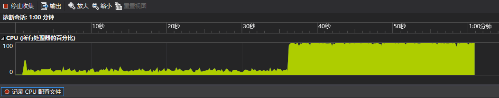
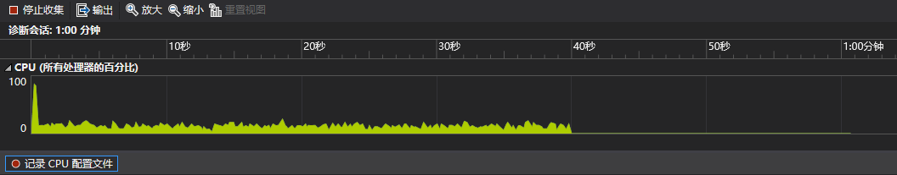

## 线程池

* 线程池一般会用一个表示线程数的参数来初始化，内部需要一个队列来存储任务。下面是一个最简单的线程池实现

```cpp
class thread_pool {
  std::mutex m;
  std::condition_variable cv;
  bool done = false; // 线程池析构标志
  std::queue<std::function<void()>> q; // 存储任务的队列
 public:
  explicit thread_pool(unsigned n) // n为线程数
  {
    for (unsigned i = 0; i < n; ++i)
    {
      std::thread{
        [this]
        {
          std::unique_lock l(m);
          for (;;)
          {
            if (!q.empty())
            {
              auto task = std::move(q.front());
              q.pop();
              l.unlock();
              task();
              l.lock();
            }
            else if (done) // if (q.empty() && done)
            {
              break;
            }
            else // if (q.empty() && !done)
            {
              cv.wait(l);
            } // 等价于cv.wait(l, [this] { return done || q.empty(); });
          }
        }
      }.detach();
    }
  }

  ~thread_pool()
  {
    {
      std::scoped_lock l(m);
      done = true; // 加锁的原因是cv.wait使用了done作为判断条件
    }
    cv.notify_all();
  }

  template<typename F>
  void submit(F&& f)
  {
    {
      std::scoped_lock l(m);
      q.emplace(std::forward<F>(f));
    }
    cv.notify_one();
  }
};
```

* 如果想让提交的任务带参数会麻烦很多

```cpp
template<class F, class... Args>
auto submit(F&& f, Args&&... args)
{
  using RT = std::invoke_result_t<F, Args...>;
  auto task = // std::packaged_task不允许拷贝构造，不能直接传入lambda，因此要借助std::shared_ptr
    std::make_shared<std::packaged_task<RT()>>(std::bind(std::forward<F>(f), std::forward<Args>(args)...));
  // 但std::bind会按值拷贝实参，因此这个实现不允许任务的实参是move-only类型
  {
    std::scoped_lock l(m);
    q.emplace([task]() { (*task)(); }); // 捕获指针以传入std::packaged_task
  }
  cv.notify_one();
  return task->get_future();
}
```

* 书上实现的线程池都在死循环中使用了[std::this_thread::yield](https://en.cppreference.com/w/cpp/thread/yield)来转让时间片，但这样做的问题是，如果线程池处于空闲状态，就会无限转让时间片，导致CPU使用率达100%，下面是对书中的第一个简单线程池的CPU使用率测试结果



* 对相同任务用之前实现的线程池的测试结果



* 因此书中的线程池实现是不合理的，不过这里还是把书上的内容列出来，以下均为书中内容
* 最简单的线程池

```cpp
class thread_pool {
  // 析构时会倒序析构，为了确保析构不出问题要注意声明顺序
  std::atomic<bool> done;
  thread_safe_queue<std::function<void()>> q;
  std::vector<std::thread> threads; // 标记和任务队列要在此之前声明
  threads_guard g; // threads_guard在最后声明
  void worker_thread()
  {
    while (!done)
    {
      std::function<void()> task;
      if (q.try_pop(task))
      {
        task();
      }
      else
      {
        std::this_thread::yield();
      }
    }
  }
 public:
  thread_pool() : done(false), g(threads)
  {
    const unsigned n = std::thread::hardware_concurrency();
    try
    {
      for (unsigned i = 0; i < n; ++i)
      {
        threads.emplace_back(&thread_pool::worker_thread, this);
      }
    }
    catch(...)
    {
      done = true;
      throw;
    }
  }

  ~thread_pool() { done = true; }

  template<typename F>
  void submit(F f)
  {
    q.push(std::function<void()>(f));
  }
};
```

* 不过这个线程池过于简单，只能执行无参数无返回值的函数，并且可能出现死锁，不足以满足大多数情况的要求，下面希望能执行无参数但有返回值的函数。为了得到返回值，就应该把函数传递给[std::packaged_task](https://en.cppreference.com/w/cpp/thread/packaged_task)再加入队列，并返回[std::packaged_task](https://en.cppreference.com/w/cpp/thread/packaged_task)中的[std::future](https://en.cppreference.com/w/cpp/thread/future)。由于[std::packaged_task](https://en.cppreference.com/w/cpp/thread/packaged_task)是move-only类型，而[std::function](https://en.cppreference.com/w/cpp/utility/functional/function)要求存储的函数实例可以拷贝构造，因此这里需要实现一个支持move-only类型的函数包裹类，即一个带call操作的类型擦除（type-erasure）类

```cpp
class function_wrapper {
  struct impl_base {
    virtual void call() = 0;
    virtual ~impl_base() {}
  };
  std::unique_ptr<impl_base> impl;

  template<typename F>
  struct impl_type : impl_base
  {
    F f;
    impl_type(F&& f_) noexcept: f(std::move(f_)) {}
    void call() override { f(); }
  };
 public:
  function_wrapper() = default;
  function_wrapper(const function_wrapper&) = delete;
  function_wrapper& operator=(const function_wrapper&) = delete;
  function_wrapper(function_wrapper&& rhs) noexcept : impl(std::move(rhs.impl)) {}
  function_wrapper& operator=(function_wrapper&& rhs) noexcept
  {
    impl = std::move(rhs.impl);
    return *this;
  }
  template<typename F>
  function_wrapper(F&& f) : impl(new impl_type<F>(std::move(f))) {}

  void operator()() const { impl->call(); }
};
```

* 用这个包裹类替代`std::function<void()>`

```cpp
class thread_pool {
  std::atomic<bool> done;
  thread_safe_queue<function_wrapper> q;
  std::vector<std::thread> threads;
  threads_guard g;
  void worker_thread()
  {
    while (!done)
    {
      function_wrapper task;
      if (q.try_pop(task))
      {
        task();
      }
      else
      {
        std::this_thread::yield();
      }
    }
  }
 public:
  thread_pool() : done(false), g(threads)
  {
    const unsigned n = std::thread::hardware_concurrency();
    try
    {
      for (unsigned i = 0; i < n; ++i)
      {
        threads.emplace_back(&thread_pool::worker_thread, this);
      }
    }
    catch(...)
    {
      done = true;
      throw;
    }
  }

  ~thread_pool() { done = true; }

  template<typename F>
  std::future<std::invoke_result_t<F>> submit(F f)
  {
    std::packaged_task<std::invoke_result_t<F>()> task(std::move(f));
    std::future<std::invoke_result_t<F>> res(task.get_future());
    q.push(std::move(task));
    return res;
  }
};
```

* 往线程池添加任务会增加任务队列的竞争，lock-free队列可以避免这点但存在乒乓缓存的问题。为此需要把任务队列拆分为线程独立的本地队列和全局队列，当线程队列无任务时就去全局队列取任务

```cpp
class thread_pool {
  std::atomic<bool> done;
  thread_safe_queue<function_wrapper> pool_work_queue;
  inline static thread_local std::unique_ptr<std::queue<function_wrapper>> local_work_queue;
  std::vector<std::thread> threads;
  threads_guard g;
  void worker_thread()
  {
    local_work_queue.reset(new std::queue<function_wrapper>);
    while (!done)
    {
      function_wrapper task;
      if (local_work_queue && !local_work_queue->empty())
      {
        task = std::move(local_work_queue->front());
        local_work_queue->pop();
        task();
      }
      else if (pool_work_queue.try_pop(task))
      {
        task();
      }
      else
      {
        std::this_thread::yield();
      }
    }
  }
 public:
  thread_pool() : done(false), g(threads)
  {
    const unsigned n = std::thread::hardware_concurrency();
    try
    {
      for (unsigned i = 0; i < n; ++i)
      {
        threads.emplace_back(&thread_pool::worker_thread, this);
      }
    }
    catch(...)
    {
      done = true;
      throw;
    }
  }

  ~thread_pool() { done = true; }

  template<typename F>
  std::future<std::invoke_result_t<F>> submit(F f)
  {
    std::packaged_task<std::invoke_result_t<F>()> task(std::move(f));
    std::future<std::invoke_result_t<F>> res(task.get_future());
    if (local_work_queue)
    {
      local_work_queue->push(std::move(task));
    }
    else
    {
      pool_work_queue.push(std::move(task));
    }
    return res;
  }
};
```

* 这可以避免数据竞争，但如果任务分配不均，就会导致某个线程的本地队列中有很多任务，而其他线程无事可做，为此应该让没有工作的线程可以从其他线程获取任务

```cpp
class work_stealing_queue {
  std::deque<function_wrapper> the_queue;
  mutable std::mutex m;
 public:
  work_stealing_queue() {}
  work_stealing_queue(const work_stealing_queue&) = delete;
  work_stealing_queue& operator=(const work_stealing_queue&) = delete;

  void push(function_wrapper data) 
  {
    std::lock_guard<std::mutex> l(m);
    the_queue.push_front(std::move(data));
  }

  bool empty() const
  {
    std::lock_guard<std::mutex> l(m);
    return the_queue.empty();
  }

  bool try_pop(function_wrapper& res)
  {
    std::lock_guard<std::mutex> l(m);
    if (the_queue.empty()) return false;
    res = std::move(the_queue.front());
    the_queue.pop_front();
    return true;
  }

  bool try_steal(function_wrapper& res) 
  {
    std::lock_guard<std::mutex> l(m);
    if (the_queue.empty()) return false;
    res = std::move(the_queue.back());
    the_queue.pop_back();
    return true;
  }
};

class thread_pool {
  std::atomic<bool> done;
  thread_safe_queue<function_wrapper> pool_work_queue;
  std::vector<std::unique_ptr<work_stealing_queue>> queues;
  std::vector<std::thread> threads;
  threads_guard g;
  static thread_local work_stealing_queue* local_work_queue;
  static thread_local unsigned my_index;

  bool pop_task_from_local_queue(function_wrapper& task)
  {
    return local_work_queue && local_work_queue->try_pop(task);
  }

  bool pop_task_from_pool_queue(function_wrapper& task)
  {
    return pool_work_queue.try_pop(task);
  }

  bool pop_task_from_other_thread_queue(function_wrapper& task)
  {
    for (unsigned i = 0; i < queues.size(); ++i)
    {
      const unsigned index = (my_index + i + 1) % queues.size();
      if (queues[index]->try_steal(task)) return true;
    }
    return false;
  }

  void worker_thread(unsigned my_index_)
  {
    my_index = my_index_;
    local_work_queue = queues[my_index].get();
    while (!done)
    {
      function_wrapper task;
      if (pop_task_from_local_queue(task) ||
        pop_task_from_pool_queue(task) ||
        pop_task_from_other_thread_queue(task))
      {
        task();
      }
      else
      {  
        std::this_thread::yield();
      }
    }
  }
 public:
  thread_pool() : done(false), g(threads)
  {
    const unsigned n = std::thread::hardware_concurrency();
    try
    {
      for (unsigned i = 0; i < n; ++i)
      {
        queues.emplace_back(std::make_unique<work_stealing_queue>());
        threads.emplace_back(&thread_pool::worker_thread, this, i);
      }
    }
    catch(...)
    {
      done = true;
      throw;
    }
  }

  ~thread_pool() { done = true; }

  template<typename F>
  std::future<std::invoke_result_t<F>> submit(F f)
  {
    std::packaged_task<std::invoke_result_t<F>()> task(std::move(f));
    std::future<std::invoke_result_t<F>> res(task.get_future());
    if (local_work_queue)
    {
      local_work_queue->push(std::move(task));
    }
    else
    {
      pool_work_queue.push(std::move(task));
    }
    return res;
  }
};

thread_local work_stealing_queue* thread_pool::local_work_queue;
thread_local unsigned thread_pool::my_index;
```

## 中断

* 可中断线程的简单实现

```cpp
class interrupt_flag {
 public:
  void set();
  bool is_set() const;
};

thread_local interrupt_flag this_thread_interrupt_flag;

class interruptible_thread {
  std::thread t;
  interrupt_flag* flag;
 public:
  template<typename F>
  interruptible_thread(F f)
  {
    std::promise<interrupt_flag*> p;
    t = std::thread([f,&p] {
      p.set_value(&this_thread_interrupt_flag);
      f();
    });
    flag = p.get_future().get();
  }
  void interrupt()
  {
    if (flag) flag->set();
  }
};

void interruption_point()
{
  if (this_thread_interrupt_flag.is_set())
  {
    throw thread_interrupted();
  }
}
```

* 在函数中使用

```cpp
void f()
{
  while (!done)
  {
    interruption_point();
    process_next_item();
  }
}
```

* 尽管这可以工作，但不是理想的，更好的方式是用[std::condition_variable](https://en.cppreference.com/w/cpp/thread/condition_variable)来唤醒，而非在循环中持续运行

```cpp
class interrupt_flag {
  std::atomic<bool> flag;
  std::condition_variable* thread_cond;
  std::mutex m;
 public:
  interrupt_flag(): thread_cond(nullptr) {}

  void set()
  {
    flag.store(true, std::memory_order_relaxed);
    std::lock_guard<std::mutex> l(m);
    if (thread_cond) thread_cond->notify_all();
  }

  bool is_set() const
  {
    return flag.load(std::memory_order_relaxed);
  }

  void set_condition_variable(std::condition_variable& cv)
  {
    std::lock_guard<std::mutex> l(m);
    thread_cond = &cv;
  }

  void clear_condition_variable()
  {
    std::lock_guard<std::mutex> l(m);
    thread_cond = nullptr;
  }

  struct clear_cv_on_destruct
  {
    ~clear_cv_on_destruct()
    {
      this_thread_interrupt_flag.clear_condition_variable();
    }
  };
};

void interruptible_wait(std::condition_variable& cv, std::unique_lock<std::mutex>& l)
{
  interruption_point();
  this_thread_interrupt_flag.set_condition_variable(cv);
  interrupt_flag::clear_cv_on_destruct guard; // 下面的wait_for可能抛异常，所以需要RAII来清除标志
  interruption_point();
  cv.wait_for(l, std::chrono::milliseconds(1)); // 设置线程看到中断前的等待时间上限
  interruption_point();
}

template<typename Predicate>
void interruptible_wait(std::condition_variable& cv, std::unique_lock<std::mutex>& l, Predicate pred)
{
  interruption_point();
  this_thread_interrupt_flag.set_condition_variable(cv);
  interrupt_flag::clear_cv_on_destruct guard;
  while (!this_thread_interrupt_flag.is_set() && !pred())
  {
    cv.wait_for(l, std::chrono::milliseconds(1));
  }
  interruption_point();
}
```

* 和[std::condition_variable](https://en.cppreference.com/w/cpp/thread/condition_variable)不同的是，[std::condition_variable_any](https://en.cppreference.com/w/cpp/thread/condition_variable_any)可以使用不限于[std::unique_lock](https://en.cppreference.com/w/cpp/thread/unique_lock)的任何类型的锁，这意味着可以使用自定义的锁类型

```cpp
class interrupt_flag {
  std::atomic<bool> flag;
  std::condition_variable* thread_cond;
  std::condition_variable_any* thread_cond_any;
  std::mutex m;

 public:
  interrupt_flag() : thread_cond(nullptr), thread_cond_any(nullptr) {}

  void set()
  {
    flag.store(true, std::memory_order_relaxed);
    std::lock_guard<std::mutex> l(m);
    if (thread_cond)
    {
      thread_cond->notify_all();
    }
    else if (thread_cond_any)
    {
      thread_cond_any->notify_all();
    }
  }

  template<typename Lockable>
  void wait(std::condition_variable_any& cv, Lockable& l)
  {
    struct custom_lock {
      interrupt_flag* self;
      Lockable& l;

      custom_lock(interrupt_flag* self_, std::condition_variable_any& cond, Lockable& l_)
      : self(self_),l(l_)
      {
        self->m.lock();
        self->thread_cond_any = &cond;
      }

      void unlock()
      {
        l.unlock();
        self->m.unlock();
      }

      void lock()
      {
        std::lock(self->m, l);
      }

      ~custom_lock()
      {
        self->thread_cond_any = nullptr;
        self->m.unlock();
      }
    };
    custom_lock cl(this, cv, l);
    interruption_point();
    cv.wait(cl);
    interruption_point();
  }
  // rest as before
};

template<typename Lockable>
void interruptible_wait(std::condition_variable_any& cv, Lockable& l)
{
  this_thread_interrupt_flag.wait(cv, l);
}
```

* 对于其他阻塞调用（比如mutex、future）的中断一般也可以像对[std::condition_variable](https://en.cppreference.com/w/cpp/thread/condition_variable)一样使用timeout，因为不访问内部mutex或future无法在未满足等待的条件时中断等待

```cpp
template<typename T>
void interruptible_wait(std::future<T>& ft)
{
  while (!this_thread_interrupt_flag.is_set())
  {
    if (ft.wait_for(l, std::chrono::milliseconds(1)) == std::future_status::ready) break;
  }
  interruption_point();
}
```

* 从被中断的线程角度来看，中断就是一个`thread_interrupted`异常。因此检查出中断后，可以像异常一样对其进行处理

```cpp
internal_thread = std::thread([f, &p]{
  p.set_value(&this_thread_interrupt_flag);
  try
  {
    f();
  } // 异常传入std::thread的析构函数时将调用std::terminate
  catch(const thread_interrupted&){} // 为了防止程序终止就要捕获异常
});
```

* 假如有一个桌面搜索程序，除了与用户交互，程序还需要监控文件系统的状态，以识别任何更改并更新其索引。为了避免影响GUI的响应性，这个处理通常会交给一个后台线程，后台线程需要运行于程序的整个生命周期。这样的程序通常只在机器关闭时退出，而在其他情况下关闭程序，就需要井然有序地关闭后台线程，一个关闭方式就是中断

```cpp
std::mutex config_mutex;
std::vector<interruptible_thread> background_threads;

void background_thread(int disk_id)
{
  while (true)
  {
    interruption_point();
    fs_change fsc = get_fs_changes(disk_id);
    if (fsc.has_changes()) update_index(fsc);
  }
}

void start_background_processing()
{
  background_threads.emplace_back(background_thread, disk_1);
  background_threads.emplace_back(background_thread, disk_2);
}

int main()
{
  start_background_processing();
  process_gui_until_exit();
  std::unique_lock<std::mutex> l(config_mutex);
  for (auto& x : background_threads) x.interrupt();
  // 中断所有线程后再join
  for (auto& x : background_threads) x.join();
  // 不直接在一个循环里中断并join的目的是为了并发
  // 因为中断不会立即完成，它们必须进入下一个中断点，
  // 再在退出前必要地调用析构和异常处理的代码
  // 如果对每个线程都中断后立即join，就会造成中断线程的等待，
  // 即使它还可以做一些有用的工作，比如中断其他线程
}
```
